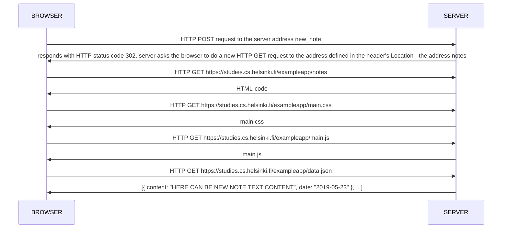

# diagram-http-NEW-NOTE
## What will happen if we will add new note with submit button from the form

```mermaid
sequenceDiagram
    participant BROWSER
    participant SERVER
    BROWSER->>SERVER: HTTP POST request to the server address new_note
    SERVER->>BROWSER: responds with HTTP status code 302, server asks the browser to do a new HTTP GET request to the address defined in the header's Location - the address notes
    BROWSER->>SERVER: HTTP GET https://studies.cs.helsinki.fi/exampleapp/notes
    SERVER->>BROWSER: HTML-code
    BROWSER->>SERVER: HTTP GET https://studies.cs.helsinki.fi/exampleapp/main.css
    SERVER->>BROWSER: main.css
    BROWSER->>SERVER: HTTP GET https://studies.cs.helsinki.fi/exampleapp/main.js
    SERVER->>BROWSER: main.js
    BROWSER->>SERVER: HTTP GET https://studies.cs.helsinki.fi/exampleapp/data.json
    SERVER->>BROWSER: [{ content: "HERE CAN BE NEW NOTE TEXT CONTENT", date: "2019-05-23" }, ...]
    
```
